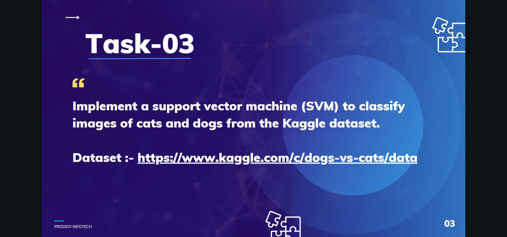

# Cats vs Dogs Image Classifier

> Task 3 of my **Machine Learning internship at [Prodigy InfoTech](https://prodigyinfotech.dev/)**.



A convolutional neural network that classifies a photo as a **cat** or a **dog**, served through a Flask web app.

- **Data:** [Kaggle — Dogs vs. Cats](https://www.kaggle.com/c/dogs-vs-cats) (25,000 labelled images)
- **Preprocessing:** resize to 64×64, scale pixels to [0, 1]
- **Model:** Keras CNN (convolution + pooling blocks, dense head, sigmoid output) — see `Cats_vs_Dogs.ipynb`
- **Result:** **88.7% validation accuracy** (precision 0.87, recall 0.91)

## SVM first, then a CNN

The task asked for a **Support Vector Machine**. I started there: a linear SVM on flattened 64×64 pixels reached only **54% validation accuracy** — barely better than guessing, because raw pixels carry no notion of shape or texture. Switching to a **CNN**, which learns edges, textures and parts through convolution, raised validation accuracy to **88.7%**. Both are in `Cats_vs_Dogs.ipynb`.

## Run

```bash
python app.py
```

Then open http://127.0.0.1:5000, upload a JPG/PNG, and the app shows the prediction with its confidence.

## Files

| File | Purpose |
|---|---|
| `Cats_vs_Dogs.ipynb` | Training and evaluation |
| `cats_vs_dogs_model.h5` | Trained model |
| `app.py`, `templates/index.html` | Flask web app |
